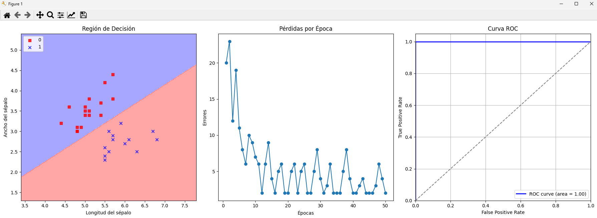
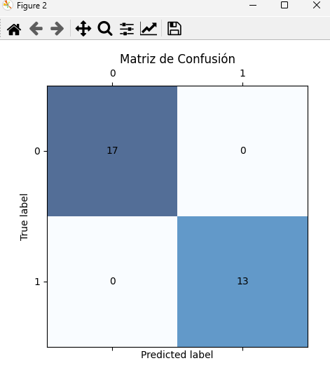

# Perceptron Implementation and Visualization

Este proyecto implementa un perceptrón para clasificar el dataset de iris (dos clases y dos características seleccionadas) y visualiza los resultados de diferentes maneras.

## Estructura del Proyecto

El proyecto está dividido en varios módulos para mantener el código organizado y fácil de mantener. A continuación se presenta una descripción de cada módulo.

### Módulos

1. **dataset_loader.py**:
    - Este módulo se encarga de cargar y preparar los datos.
    - Función principal:
        - `Process()`: Carga el dataset de iris, selecciona dos clases y dos características, y divide los datos en conjuntos de entrenamiento y prueba.

2. **Perceptron.py**:
    - Este módulo contiene la implementación del perceptrón.
    - Clase principal:
        - `Perceptron`: Implementa el algoritmo de aprendizaje del perceptrón con métodos para ajustar (fit) y predecir (predict) los datos.

3. **grapics.py**:
    - Este módulo contiene funciones para la visualización de datos y resultados.
    - Funciones principales:
        - `plot_decision_regions(X, y, classifier, resolution=0.02)`: Visualiza las regiones de decisión del clasificador.
        - `plot_errors(errors)`: Grafica los errores por época durante el entrenamiento.
        - `plot_roc_curve(y_test, y_probs)`: Grafica la curva ROC y calcula el área bajo la curva (AUC).
        - `plot_confusion_matrix(y_test, y_pred)`: Visualiza la matriz de confusión de las predicciones.

4. **main.py**:
    - Es el módulo principal que ejecuta el flujo principal del programa: carga de datos, entrenamiento del modelo, visualización y evaluación de resultados.
    

